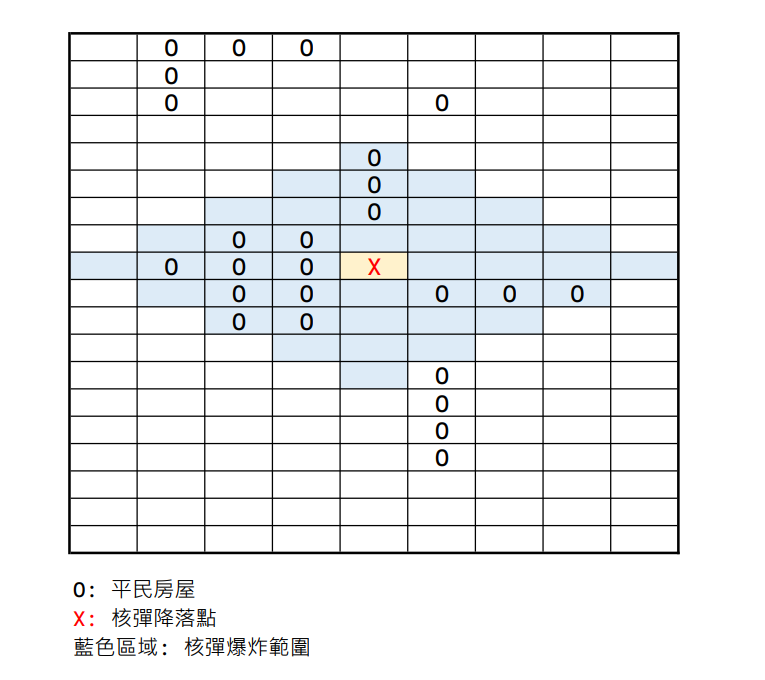

# 最小轟炸區

> 題目作者: iblackcat#4119

## 題目
西元5XXX年，第N次世界大戰開打，在世界各地常常見到有核彈轟炸的情況傳出，這一些核彈往往都往平民的生活區扔，造成無數多民無辜百姓的傷亡。<br>
過了10年，戰爭結束，新的國家紛紛建立，住在SZ國的Dr Proladon博士想要了解這些核彈的細節，於是設計了一個程式，輸入這一區域的訊息，經過程式運算過後會跑出核彈的威力，他設計的程式輸入規則如下：

1. 輸入區域的大小
2. 在這個區域內標記出平民房屋的位置
3. 輸入核彈轟炸的絕對位置

Dr Prolaon博士利用這個程式，發現在西元5XXX年，在世界各地放下去的核彈具有「自動炸藥放大」的特殊功能。而導致這些核彈威力變大的關鍵在於：每一枚核彈都會有自動辨識系統，可根據這一個區域的房屋數量多寡判斷出「最小破壞力」，如下圖：<br>
<br>
<br>
根據上圖，若以圓的半徑來看，這枚核彈的最小破壞力為4(為方便計算，核彈降落點不計)。<br>
但由於Dr Proladon博士在某一次的打掃中弄丟了這隻程式。因此身為助理的你，現在需要幫Dr Proladon博士重新打造出這隻程式，好讓他在五天後能在學術研討會上如期說明。

---

## 輸入
第一行輸入)，分別為這個區域的寬跟長。<br>
根據第一行所界定的範圍，第二行開始，每一行分別輸入平民區的標記)，若輸入$-1 -1$代表輸入結束。<br>
最後一行輸入核彈落下的絕對位置)

## 輸出
根據上述所說的資訊，輸出一個整數$b$，代表這枚核彈的最小破壞力。

---

## 範例輸入
```
9 19
0 1
0 2
0 3
1 1
2 1
2 5
4 4
5 4
6 4
7 2
7 3
8 1
8 2
8 3
9 2
9 3
9 5
9 6
9 7
10 2
10 3
12 5
13 5
14 5
-1 -1
8 4
```

## 範例輸出
```
5
```